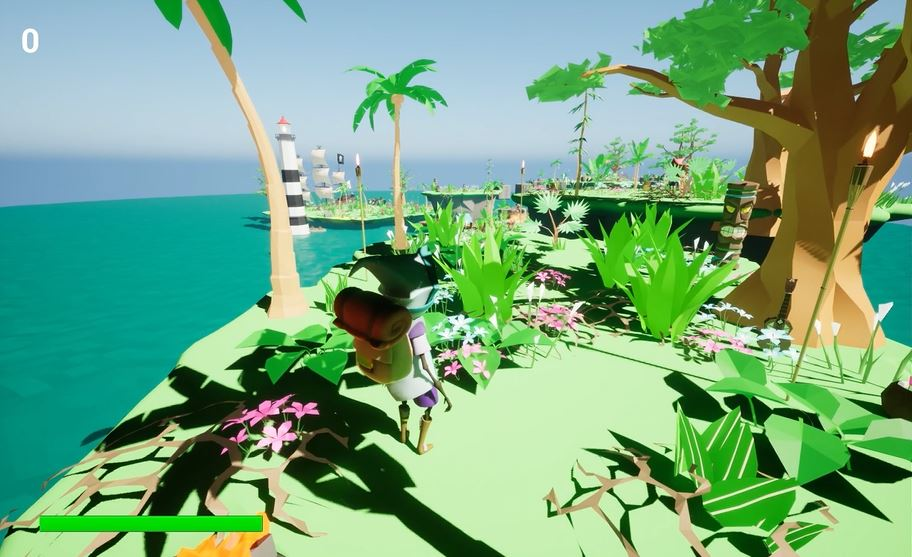
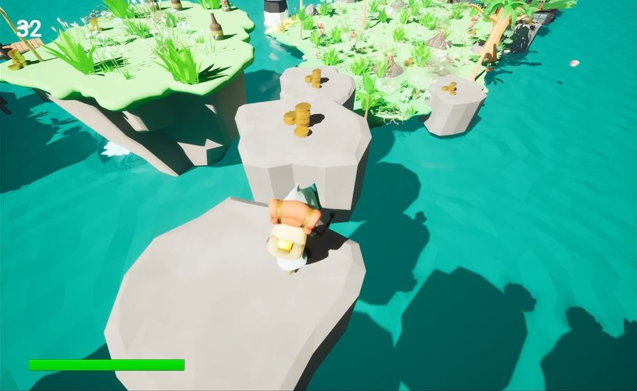
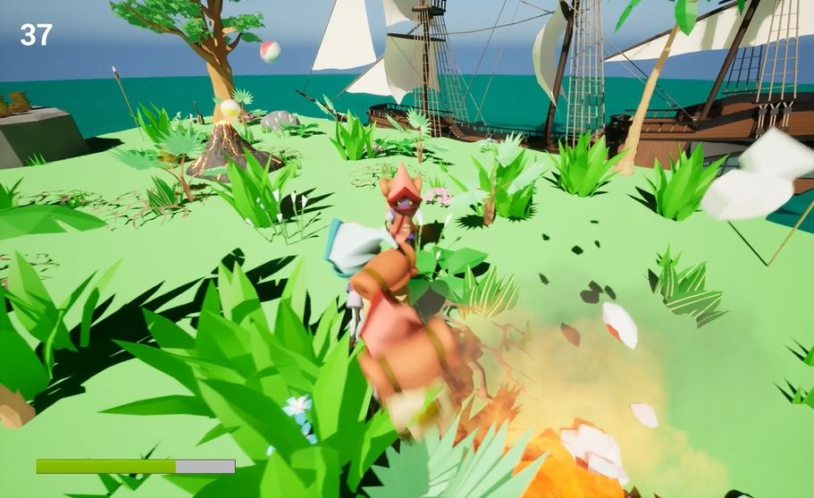
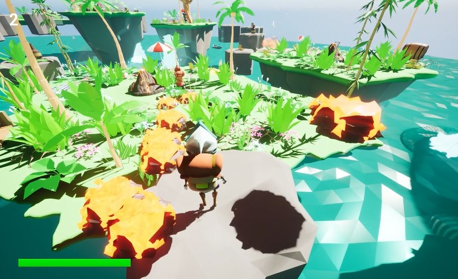

# MP2_LevelDesign
This repository is my MP2: Level Design project for CS 415: Game Development. To run, clone the repository and open the project in Unreal Engine 5.

This game is a third person 3D Platformer, where the player explores various islands to get to a pirate ship. The player must avoid enemies or defeat them by jumping on their "heads". Additionally, the player drops "spikes" and landmines behind themselves every second to make them consider the path they are taking since they will likely not be able to tread or cross the same path twice.

## Level Design

The level consists of a bunch of small islands, large islands, and rock platforms the player must traverse to get to the end. The end point is the pirate ship, which is made larger so the player can see it easily. The level is generally linear as there is usually only one path to get to the next island to progress (usually by jumping to the next island). A few of the jumps are jumping from a higher island to a lower island, so the player can’t turn back. However, I added some larger side islands, so the player can go off the main path to explore the larger islands for more collectibles. This comes with a cost though as there are more enemies to navigate and defeat. The islands are where the enemies are and is where most of the exploring and fighting happens. The rock platforms are to add some variety to the game and focus more on timing the jumps.

The smaller islands are designed to have at most one enemy on them: either a pursuer enemy or a mortar enemy. This way, the player must engage with the enemy and cannot avoid them. The islands with the pursuer enemy have large objects like large trees and fun decorations the player can hide behind to avoid being seen. This is to specifically consider the pursuer enemy’s design of seeing and chasing the player. The islands with the mortar island have been sized so that most of the mortar projectiles land on the island. This way, the player cannot avoid the mortar enemy by walking far away from it.

As the level progresses, the number of enemies on the bigger islands increases for extra challenge. The last island where the pirate ship is docked is very large and has three pursuers and three mortars to defeat and navigate to simulate sort of a “boss” level. There are numerous collectibles to get around the entire island, both in the middle and around the outside edges. This encourages exploration and dealing with the enemies. However, theoretically, the player could just run directly to the end of the level.

The last small island before the last big island only has health packs and collectibles to let the player rest for a second before charging into the “boss” level. The height of the last small island is made a lot taller than the last big island so the player cannot turn back. There are no health packs on the last big island so it’s more challenging.

The other islands have numerous coins and health packs spread around the perimeter of the islands to encourage exploration. The larger islands have rock platforms along their perimeter that have several collectibles and / or health packs to add intrigue and to make them easier to see.

My third enemy design consists of spikes and landmines dropped by the player character every 1 second. The spikes do the same amount of damage as the mortar and pursuer enemies. The landmine, however, instantly explodes and kills the player when touched. There is a 10% chance a landmine is dropped and a 90% change a spike is dropped. The spikes and landmines always spawn a little bit behind the character. This enemy design is meant to keep the player on their toes and make the player consider the path they take as they traverse the level. This enemy makes it more difficult to travel on the same path twice or even cross the same path. This enemy design could promote either a sense of urgency or a sense of going slower and taking more time to decide which path to take, depending on the player. 

The level design is beach / pirate themed. The collectibles are piles of gold coins, and the health packs are bottles of rum. The pursuer enemy is a red version of the player, and the mortar enemy is a volcano that shoots out exploding beach balls. The spikes are little rocks with lava, and the landmines are white seashells. 

